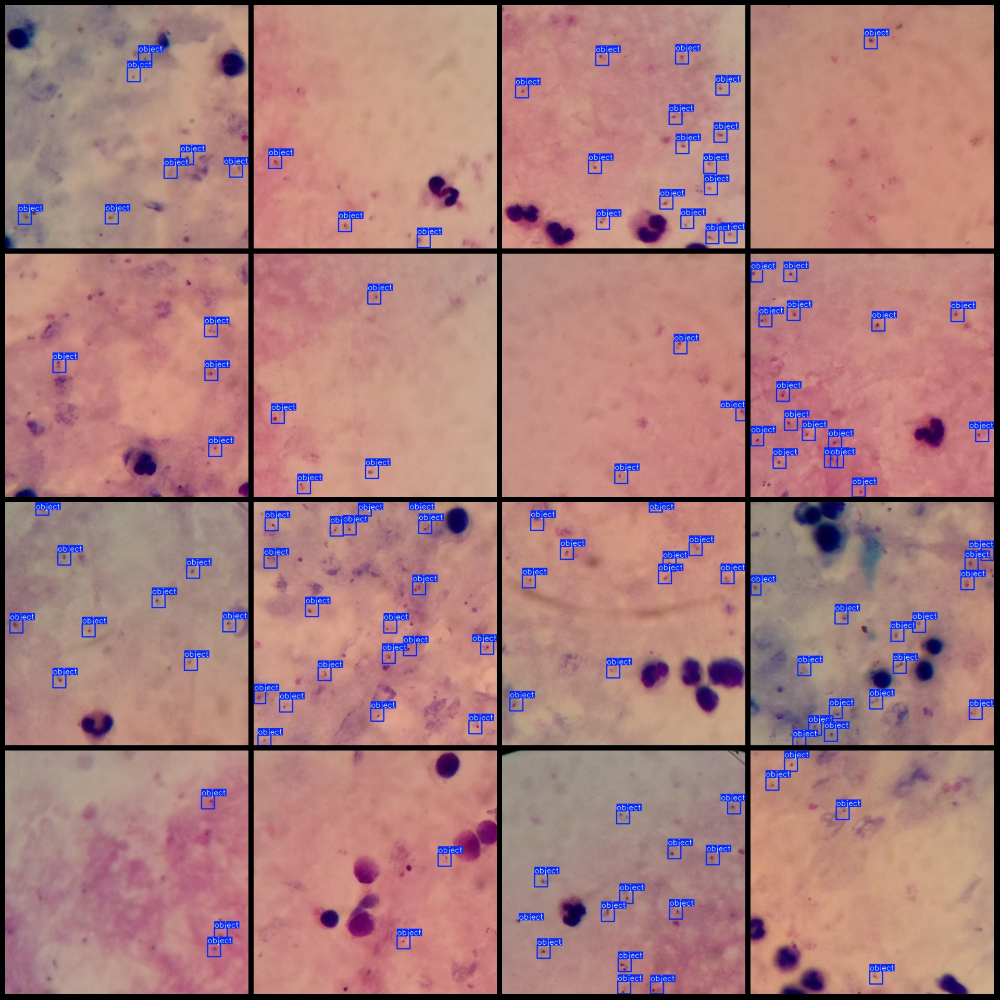
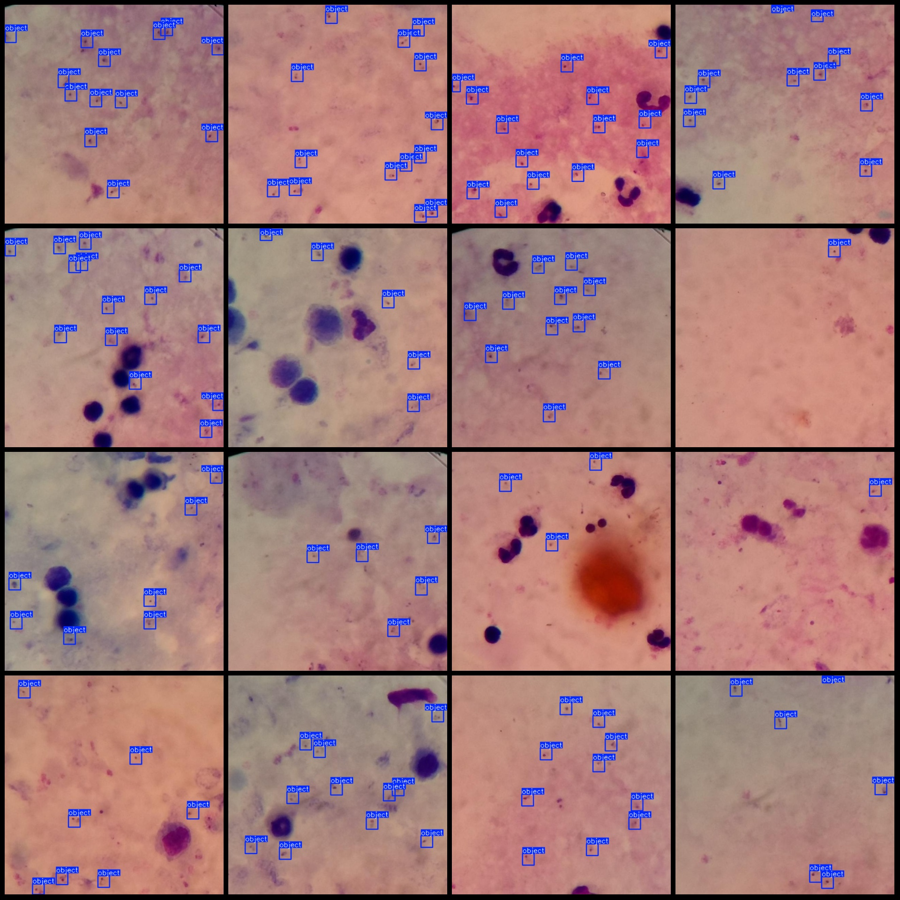

# Malaria Cell Detection Dataset VOC+YOLO with 948 images in one class

Dataset format: Pascal VOC format + YOLO format (txt files without split paths, only containing jpg images and corresponding VOC format xml files and yolo format txt files)
number of images: 948  
annotation count: 948  
annotation count: 948  
annotationnumber of classes: 1  
Category Name: ["object"]
boxes per class:   
object box count = 7628  
Total frames: 7628
images per class:   
object images = 948  
Image resolution: 640x640
Use LabelImg
Annotation rule: Drawing a rectangle around the class.
Important notes: The dataset does not have a split into training, validation, and test sets; you need to partition it yourself.
Special Notice: This dataset does not guarantee the accuracy of the trained model or weight files.
Image preview:
## Images

Here is a pay link on Stripe ( https://buy.stripe.com/3cs8yP7sY87d0vu9AB ). Please contact me lonlonago@foxmail.com after funding $89, and I will send you a complete data files , thank you!

